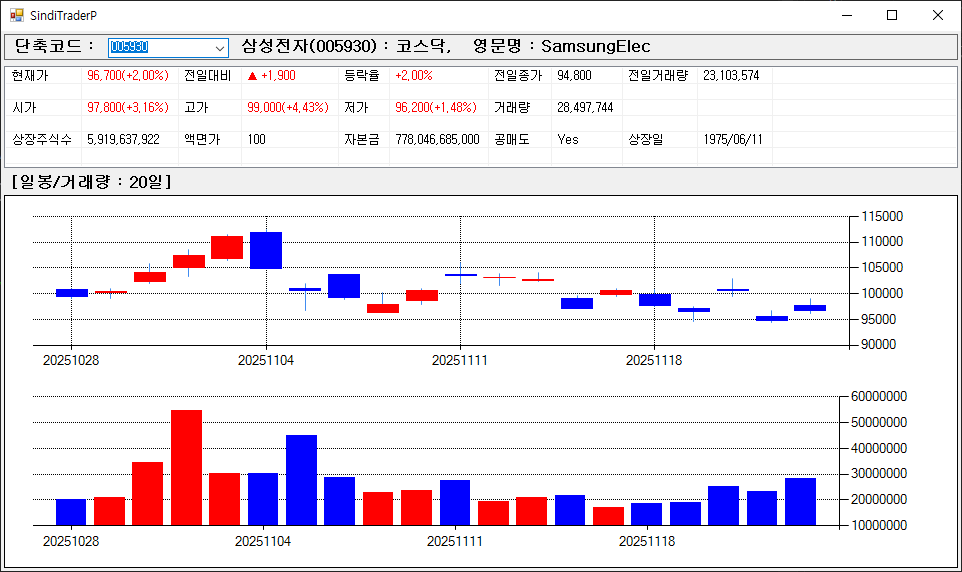

# SindiTraderPwfm : [신한i indi] C# Winform 버전입니다.

## 개발 환경  
 - Visual Studio Community 2022 (64-bit)
 - .NET Framework 4.8
 - C# 7.2
 

 ## 브랜치
 - main : README
 - Winform
 - MVC
 - MVP

## Get started
 * [신한i indi]가 설치되어 있어야 합니다.
 * SindiTrader\WfmForm\WfmForm.IDPW.cs를 사용자 정보로 수정.
 
 * SindiTrader\MVC\View\WfmView.IDPW.cs를 사용자 정보로 수정.
 * SindiTrader\MVP\View\WfmView.IDPW.cs를 사용자 정보로 수정.
 
 * 빌드 후 실행 파일 : EXE\SindiTraderPwfm.exe
 * 실행 파일은 관리자 권한으로 실행되어야 합니다.
 

# * 오픈소스입니다. 사용상 책임은 사용자에게 있습니다*
